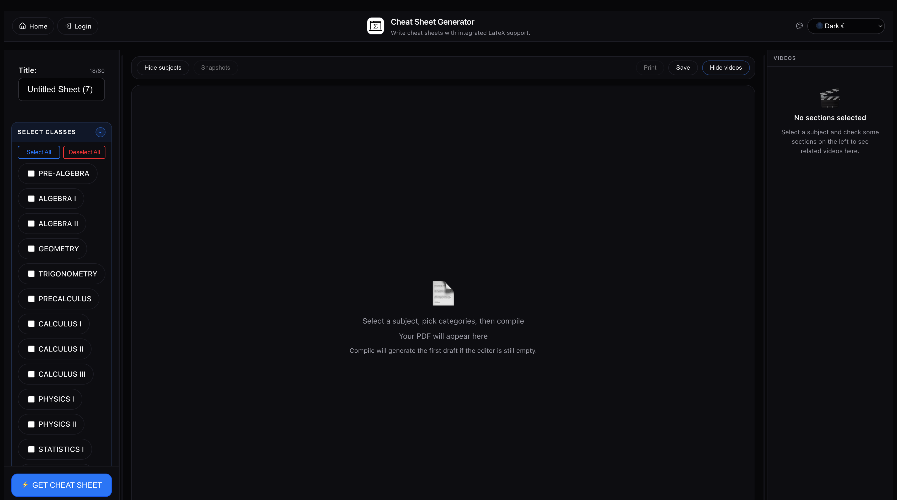

# Cheat Sheet Generator

<p align="center">
  
</p>

<p align="center">
  Full-stack React + Django editor for building LaTeX cheat sheets with live PDF preview, local draft recovery, account-backed saves, compile snapshots, and section-based YouTube study picks.
</p>

<p align="center">
  <a href="https://github.com/SloppyBobbert/TeXGen/actions/workflows/ci.yml"></a>
  
  
  
  
  
  
  
  
</p>

<p align="center">
  <a href="#overview">Overview</a> •
  <a href="#current-editor-ui">Current Editor UI</a> •
  <a href="#features">Features</a> •
  <a href="#architecture">Architecture</a> •
  <a href="#project-structure">Project Structure</a> •
  <a href="#getting-started">Getting Started</a> •
  <a href="#api-endpoints">API Endpoints</a> •
  <a href="#checks-and-validation">Checks and Validation</a>
</p>



## Overview

Cheat Sheet Generator is a study-sheet editor for math-heavy classes. Users can pick classes and categories, generate starter LaTeX from the formula library, tune layout settings, preview compiled output, restore prior compile snapshots, and export the result as PDF or `.tex`.

The app is split into:

- a **React + Vite frontend** for the editor, dashboard, auth screens, preview controls, and resource rail
- a **Django REST API** for rendering, persistence, JWT auth, and guest or signed-in compile requests
- a **dedicated compiler container** for offline PDF compilation through a Unix socket
- a **Docker Compose setup** for local full-stack development with PostgreSQL

## Current Editor UI

The main editor is a three-region workspace:

### Left rail

- class checklist
- card-style section/category toggles with clearer collapse affordances
- drag-and-drop formula ordering grouped by class
- layout controls for columns, text size, spacing, and margins
- primary actions for compile, save, reset, and downloads

### Center workspace

- top toolbar with subject toggle, snapshot toggle, save, print, video rail toggle, and manual LaTeX editor toggle
- optional split view with LaTeX editor on one side and compiled PDF preview on the other; the editor stays closed until the user opens it
- PDF preview controls for zoom in/out, reset, fit width, fit height, and print
- animated recompilation overlay while the preview refreshes

### Right rail

- compact section-aware study video recommendations
- one curated video shown by default per selected section, with section-level expansion for more curated links
- per-section YouTube search only when the curated picks are not enough
- inline thumbnails with modal playback; video cards live only in the right rail

## Features

### Recent updates

- clearer left-rail section disclosures and a first-compile rail shrink for a wider preview
- curated class/section video links with compact right-rail cards and API search kept as a per-section fallback
- LaTeX editor remains closed by default so the compiled PDF stays front and center
- GitHub Pages project-page assets were removed; the app is now documented as a local/Docker full-stack project
- Animated compile button with shimmer effect while compiling with a green flash on success
- Toast notification now replaces the browser alert on save 
- Keyboard Shortcuts: Ctrl+Enter to compile, Ctrl+S to save, Escape to close the video modal
- Browser tab title now updates to reflect the name of the active cheat sheet 
- character counter on the title input with a limit of 80 characters
- New 'last saved' timestamp displayed next to the save button
- Scroll to top button in the PDF Preview
- Empty state illustration in the right panel when no sections are selected
- Section count badge on the right panel header
- Select all/Deselect all option above the subject class list 
- Clear search button for YouTube Search Results
- PDF page number display in the preview toolbar 
- Focus ring styles for keyboard navigation accessibility 
- Improved muted text contrast to meet the WCAG AA standards
- Custom scrollbar styling across all the panels
- Hover transitions on video cards
- Smooth transitions for panel show/hide options
- Improvements for mobile responsiveness for screens under 768px
- Divider lines between the layout option selections 
- Full implementation of YouTube videos across each subject

### Editing and generation

- formula library spanning pre-algebra through calculus
- category-based formula picking
- drag-and-drop ordering for classes and formulas
- generated LaTeX editing in-browser
- compile through the backend with Tectonic
- PDF preview with button-driven zoom controls
- print support from the current compiled PDF
- first compile narrows the subject rail to its minimum width so the preview has more room

### Layout controls

- **1 to 5 columns**
- preset and custom font sizing
- preset and custom spacing
- adjustable page margins
- automatic preview rebuild after layout-only changes

### Persistence and recovery

- browser-local draft persistence for the active sheet
- account-backed save/load for signed-in users
- local compile snapshots for the active draft
- snapshot restore flow that repopulates the editor and rebuilds preview on reopen
- local-only save success message when the user is not signed in

### UI workflow

- resizable left rail, LaTeX pane, and right rail
- hide/show subject and video rails from the toolbar
- LaTeX editor hidden by default after compile to keep the PDF preview as the main focus
- responsive layout cleanup for tighter desktop widths and smaller screens
- compile-state loading shell for preview refreshes

### Study resources

- backend-proxied YouTube search so the API key never reaches the browser
- repo-root `YOUTUBE_API_KEY` support for local runs and Docker Compose passthrough
- curated class/section links in `frontend/src/data/subjectVideos.js` shown before any API call
- section-scoped “search more” behavior so the YouTube API is a last-resort fallback for the clicked section only
- request validation and error handling for missing key, invalid topics, empty results, and upstream failures

### Themes
- Light Mode
- Dark Mode
- Miami Theme
- Forest Theme
- Cool Gray Theme
- Neon Theme
- Galaxy Theme
- Red Theme
- Pink 'Blossom' Inspired Theme

## Tech stack

| Layer | Technology |
| --- | --- |
| Frontend | React 18, Vite 6, react-pdf, dnd-kit, lucide-react, framer-motion |
| Backend | Django 6, Django REST Framework, Simple JWT |
| PDF pipeline | Tectonic 0.15.0 sidecar with verified Linux ARM64 assets |
| Database | SQLite by default, PostgreSQL in Docker |
| Tooling | Docker Compose, ESLint, Vitest, Pytest, Ruff |

## Architecture

```text
Frontend (React + Vite)
  ├─ Auth + dashboard routes
  ├─ Formula selection and ordering UI
  ├─ Layout controls + LaTeX editor
  ├─ PDF preview and export actions
  └─ YouTube resource rail
         │
         ▼
Backend (Django + DRF)
  ├─ JWT auth + registration
  ├─ Formula/class metadata
  ├─ LaTeX generation endpoint
  ├─ Guest compile + normalize endpoint (saved IDs require ownership)
  ├─ YouTube resource proxy endpoint
  └─ Template / cheat sheet / problem CRUD
         │ Unix socket (compile requests only)
         ▼
Compiler sidecar (Tectonic)
  ├─ Verified offline assets for the supported corpus
  ├─ No network or application secrets
  └─ Bounded time, memory, processes, and output
```

## Project structure

```text
.
├── backend/
│   ├── api/
│   │   ├── compilation/           # Compiler adapters, results, and source limits
│   │   ├── rendering/             # Shared document assembly and normalization
│   │   ├── formula_data/          # Class/category/formula source data
│   │   ├── compile_quota.py       # Database-backed compile admission
│   │   ├── models.py              # Templates, sheets, problems, quota windows
│   │   ├── serializers.py         # DRF serializers
│   │   ├── tests.py               # Backend API and compile tests
│   │   ├── urls.py                # API routes
│   │   └── views.py               # Generation, compile, resource, CRUD views
│   ├── cheat_sheet/
│   │   ├── settings.py            # Django settings + env loading
│   │   └── urls.py
│   ├── compiler_sidecar/          # Socket server, bounded runner, asset verification
│   ├── Dockerfile
│   ├── Dockerfile.dockerignore    # Excludes compiler assets from the backend image
│   ├── manage.py
│   └── requirements.txt
├── frontend/
│   ├── public/
│   ├── src/
│   │   ├── components/            # Editor, dashboard, auth, UI components
│   │   ├── context/               # Auth context
│   │   ├── data/                  # Curated study video links
│   │   ├── hooks/                 # Formula, latex, YouTube resource hooks
│   │   ├── App.css                # Main application styling
│   │   └── App.jsx                # Routing, shell, save workflow
│   ├── Dockerfile
│   ├── package.json
│   └── vite.config.js
├── .github/workflows/             # CI workflows
├── docker-compose.yml
├── current-ui.png
└── README.md
```

## Getting started

### Prerequisites

- Node.js 24+
- Python 3.14+
- Docker Desktop or an equivalent container runtime for the full stack
- Verified Linux ARM64 compiler assets for PDF compilation; see [Compiler support](docs/COMPILER_SUPPORT.md#build-prerequisite)

A host Tectonic installation is not required for Compose. The compiler image contains its own verified executable and cache.

### Environment

The backend reads the repo-root `.env`, then `backend/.env`. Values in `backend/.env` override root-file defaults. Existing process environment variables take precedence over both files.

For YouTube suggestions, add this in the repo-root `.env`:

```dotenv
YOUTUBE_API_KEY=your_key_here
```

Docker Compose passes `YOUTUBE_API_KEY` into the backend container from the repo-root `.env` (or from your shell environment), so the same key works in local Django runs and containers without mounting the whole root `.env` file into the container.

### Backend setup

This starts the API with compilation disabled by default. For PDF compilation, use the Compose setup below.

The development-only local adapter needs separate compiler assets and configuration; see [Compiler modes](docs/COMPILER_SUPPORT.md#compiler-modes).

```bash
cd backend
python -m venv venv
source venv/bin/activate
pip install -r requirements.txt
python manage.py migrate
python manage.py runserver
```

Backend URL:

```text
http://localhost:8000/api/
```

### Frontend setup

```bash
cd frontend
npm ci
npm run dev
```

Frontend URL:

```text
http://localhost:5173/
```

### Full stack with Docker

First stage and verify `backend/.compiler-assets` as described in [Build prerequisite](docs/COMPILER_SUPPORT.md#build-prerequisite). A clean checkout cannot build the compiler image without these files. Use a matching Linux ARM64 runtime.

Compose is a development setup, not a production deployment. Do not put application secrets in the compiler image or mount them into the compiler container.

```bash
docker compose up --build
```

Services:

- frontend: `http://localhost:5173`
- backend: `http://localhost:8000/api/`
- db: internal PostgreSQL service used by Django
- compiler: internal Unix-socket service; no network endpoint

Compile up to three PDFs successfully per browser identity without signing in; then sign in to continue. A crash or unknown compiler result can consume a credit without returning a PDF. There is no periodic reset. Clearing browser identity (or browser cookie expiry) resets the anonymous allowance. Downloading the current PDF uses no additional credit; changed source/layout requires explicit recompilation. Sign in for account storage and sync. Compilation supports the documented curated corpus, not arbitrary LaTeX.

See [Compiler support](docs/COMPILER_SUPPORT.md) for guest request limits, account quotas, package limits, and failure recovery.

## Editor workflow

1. Select one or more classes.
2. Toggle the categories you want included.
3. Reorder class groups or formulas if needed.
4. Generate or compile the sheet. Guests have three successful compilations, with no periodic reset.
5. Adjust columns, spacing, font size, or margins.
6. Open the LaTeX editor only if you need to inspect or edit the generated source.
7. Save locally or, if signed in, save to your account.
8. Restore a compile snapshot if you want to jump back to an earlier draft.
9. Export `.pdf` / `.tex` or print directly from the preview toolbar.

## API endpoints

### Authentication and health

| Method | Endpoint | Description |
| --- | --- | --- |
| GET | `/api/health/` | Service health check |
| POST | `/api/register/` | Register a new user |
| POST | `/api/token/` | Obtain JWT access and refresh tokens |
| POST | `/api/token/refresh/` | Refresh JWT access token |

### Editor and compilation

| Method | Endpoint | Description |
| --- | --- | --- |
| GET | `/api/classes/` | List classes, categories, and formulas |
| POST | `/api/generate-sheet/` | Generate LaTeX from selected formulas |
| GET | `/api/compile/` | Initialize/restore browser identity and remaining guest allowance; no compile debit |
| POST | `/api/compile/` | Normalize source or compile a PDF (three successful guest compilations); saved IDs require sign-in and ownership |
| POST | `/api/youtube-resources/` | Return top YouTube picks for selected sections |

Compilation is disabled unless a compiler mode is configured. `normalize_only` does not invoke the compiler. Explicit null source selectors are invalid; omit them for legacy compatibility or supply a valid source mode.

### Persistence

| Method | Endpoint | Description |
| --- | --- | --- |
| GET / POST | `/api/templates/` | List or create templates |
| GET / PUT / PATCH / DELETE | `/api/templates/{id}/` | Retrieve or modify a template |
| GET / POST | `/api/cheatsheets/` | List or create cheat sheets |
| GET / PUT / PATCH / DELETE | `/api/cheatsheets/{id}/` | Retrieve or modify a cheat sheet |
| GET / POST | `/api/problems/` | List or create practice problems |
| GET / PUT / PATCH / DELETE | `/api/problems/{id}/` | Retrieve or modify a practice problem |

## Available formula coverage

- PRE-ALGEBRA
- ALGEBRA I
- ALGEBRA II
- GEOMETRY
- TRIGONOMETRY
- PRECALCULUS
- CALCULUS I
- CALCULUS II
- CALCULUS III
- UNIT CIRCLE
- PHYSICS I
- PHYSICS II
- STATISTICS I
- STATISTICS II
- LINEAR ALGEBRA I
- LINEAR ALGEBRA II

Each class contains multiple categories and formulas in `backend/api/formula_data/`.

## Checks and validation

### Frontend

```bash
cd frontend
npm run lint
npm test -- --run
npm run build
```

### Backend

```bash
cd backend
python manage.py check
pytest -v --cov-fail-under=95
ruff check .
pip-audit -r requirements.txt
```

The five PostgreSQL quota tests skip under SQLite. To run them, configure a test PostgreSQL `DATABASE_URL` and set `TEXGEN_REQUIRE_POSTGRES_CONCURRENCY=1` when running `pytest tests/test_compile_quota_postgres.py`.

For the Docker-backed backend checks used before release:

```bash
docker compose run --rm backend python manage.py check
docker compose run --rm backend pytest -q
docker compose run --rm backend ruff check .
```

### Docker

```bash
docker compose config
docker compose build
```

## CI pipeline

GitHub Actions verifies:

- frontend tests, lint, and production build with Node 24
- backend Ruff checks, dependency audit, and tests with Python 3.14 and a 95% API coverage floor
- PostgreSQL compile-quota concurrency tests
- a real-stack Playwright journey on Linux ARM64, including verified compiler assets and Compose image builds

## Development notes

### Add a new API endpoint

1. Add the view in `backend/api/views.py`
2. Register the route in `backend/api/urls.py`
3. Add or update serializers if needed
4. Cover it in `backend/api/tests.py`

### Add formula content

Update the appropriate file under `backend/api/formula_data/`.

## Community

- [Code of Conduct](CODE_OF_CONDUCT.md)
- [Contributing Guide](CONTRIBUTING.md)
- [Security Policy](SECURITY.md)

## Contributing

Open issues or pull requests if you want to improve formula coverage, editor workflow, tests, or docs. For repo workflow expectations, see [CONTRIBUTING.md](CONTRIBUTING.md).

## Security

If you find a vulnerability, follow [SECURITY.md](SECURITY.md) instead of opening a public issue.

## License

No license file is currently included in this repository.
